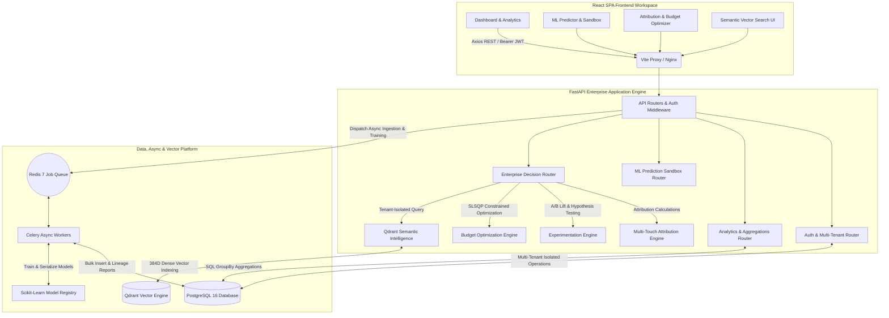

<p align="center">
  
</p>

# 📊 MarketPulse AI Enterprise Platform

An enterprise-grade Marketing Intelligence, Attribution, Experimentation, Prediction, and Budget Optimization Platform powered by PostgreSQL, Qdrant Vector Intelligence, Scikit-Learn ML, Redis/Celery Async Workers, and React SPA.

[](https://fastapi.tiangolo.com/)
[](https://react.dev/)
[](https://www.postgresql.org/)
[](https://qdrant.tech/)
[](https://redis.io/)
[](https://www.docker.com/)
[](https://scikit-learn.org/)
[](https://tailwindcss.com/)
[](LICENSE)

---

---

## 📚 Documentation Directory

Essential technical documentation is available in the [`docs/`](docs/) directory:

* 🏛️ **[System Architecture](docs/ARCHITECTURE.md)** — C4 diagram, multi-tenancy hierarchy, PostgreSQL ERD, and decision engine algorithms.
* 📡 **[REST API Specification](docs/API_DOCUMENTATION.md)** — Full endpoint parameters, schemas, authentication, and JSON response payloads.
* 🚀 **[Production Deployment Guide](docs/DEPLOYMENT_GUIDE.md)** — Docker Compose, environment variables, Nginx SSL, and backup guides.
* 🛠️ **[Developer Guide](docs/DEVELOPER_GUIDE.md)** — Local setup, repository structure, test verification suite, and frontend workflow.

---

## 🚀 Quick Start with Docker (Recommended)

Launch the complete 6-container enterprise stack (`PostgreSQL 16`, `Redis 7`, `Qdrant Vector DB`, `FastAPI Backend`, `Celery Worker`, `React Frontend`) with a single command:

```bash
docker compose up -d --build
```

### Access Platform Endpoints

* **Frontend SPA Workspace**: [`http://localhost:8080`](http://localhost:8080)
* **FastAPI Enterprise API**: [`http://localhost:8001`](http://localhost:8001)
* **OpenAPI Interactive Docs**: [`http://localhost:8001/docs`](http://localhost:8001/docs)
* **Qdrant Vector Dashboard**: [`http://localhost:6335/dashboard`](http://localhost:6335/dashboard)

---

## 🏛️ Enterprise System Architecture



---

## ✨ Enterprise Core Features

| Feature | Description | Technical Implementation |
| :--- | :--- | :--- |
| **🏢 Multi-Tenancy & Governance** | Strict organization and workspace isolation (`Organization -> Workspace -> Users/Resources`) with RBAC role enforcement (`OWNER`, `ADMIN`, `ANALYST`, `VIEWER`). | PostgreSQL Compound Indexes & Pydantic Schemas |
| **🧠 Temporal ML Platform** | Predicts CTR, Conversion Rate, and ROI with temporal time-series splitting, baseline comparison gates, and 90% ensemble prediction intervals. | Scikit-Learn (Random Forest Regressors) |
| **🔍 Qdrant Vector Intelligence** | Semantic campaign similarity search indexing 384-dimensional dense vectors with strict workspace payload metadata isolation. | Qdrant Client Vector DB & Cosine Distance |
| **📐 Multi-Touch Attribution** | Distributes revenue credit across touchpoint channels using First Touch, Last Touch, Linear, Time Decay, and Position-Based (40-20-40) models. | MultiTouchAttributionEngine |
| **🧪 Statistical A/B Testing** | Evaluates Control vs Treatment campaign variants with percentage lift, Welch's t-statistic, p-value, and 95% confidence intervals. | SciPy Statistical Engine |
| **💰 SLSQP Budget Optimization** | Solves optimal spend allocation across marketing channels to maximize expected ROI under total budget and channel spend caps. | SciPy Sequential Least Squares Programming |
| **⚡ Async Queue Execution** | Asynchronous CSV data ingestion, validation auditing, data lineage reporting, and background ML retraining. | Redis 7 & Celery Workers |
| **🔐 Security & Audit Logging** | Bcrypt password hashing, JWT refresh token rotation, CORS whitelist configuration, and immutable security audit logs. | Bcrypt & PyJWT & AuditLog Schema |

---

## 🔍 REST API Reference

<details>
<summary><b>🔐 Authentication & Multi-Tenancy (`/api/auth`)</b></summary>

* `POST /api/auth/register` - Registers analyst, provisions Organization & Workspace, and seeds ~900 sample campaigns.
* `POST /api/auth/login` - Authenticates credentials and returns JWT Access & Refresh Tokens.
* `GET /api/auth/me` - Resolves authenticated user details and active organization context.
</details>

<details>
<summary><b>📊 Analytics & Aggregations (`/api/analytics`)</b></summary>

* `GET /api/analytics/kpis` - Fetches high-performance database-side SQL aggregations for ROI, CTR, CPC, CAC, CPM, and total spend/conversions.
* `GET /api/analytics/charts` - Returns timeseries datasets, channel share ratios, and platform comparison datasets.
* `GET /api/analytics/audience` - Retrieves breakdowns for device, age co-hort, geography, and hourly performance.
</details>

<details>
<summary><b>🧠 Predictive ML Engine (`/api/predict`)</b></summary>

* `POST /api/predict/` - Simulates campaign performance parameters and returns predicted CTR, CVR, ROI, 90% uncertainty intervals, and a normalized Success Score.
* `GET /api/predict/history` - Returns recent prediction simulation history.
* `GET /api/predict/recommendations` - Generates account optimization insights.
</details>

<details>
<summary><b>🏛️ Enterprise Decision Engine (`/api/v1`)</b></summary>

* `POST /api/v1/attribution` - Computes channel revenue credit using 5 attribution models.
* `POST /api/v1/experimentation` - Evaluates A/B test variant statistical lift and p-values.
* `POST /api/v1/optimization` - Solves optimal budget allocation via SLSQP.
* `GET /api/v1/search/semantic` - Performs tenant-isolated Qdrant vector semantic campaign search.
* `GET /api/v1/jobs/{job_id}` - Checks status and progress of async background tasks.
</details>

---

## 🛠️ Local Setup (Without Docker)

### Prerequisites
- **Python 3.11+** installed.
- **Node.js v20+** and **npm** installed.

### 1. Backend Setup

1. **Navigate to the backend directory**:
   ```bash
   cd backend
   ```

2. **Create and activate a Python virtual environment**:
   * **Windows (PowerShell)**:
     ```powershell
     python -m venv venv
     .\venv\Scripts\Activate.ps1
     ```
   * **macOS/Linux**:
     ```bash
     python3 -m venv venv
     source venv/bin/activate
     ```

3. **Install dependencies**:
   ```bash
   pip install -r requirements.txt
   ```

4. **Start the FastAPI backend server**:
   ```bash
   python main.py
   ```
   The backend server will run at **`http://127.0.0.1:8000`**.

---

### 2. Frontend Setup

1. **Navigate to the frontend directory**:
   ```bash
   cd frontend
   ```

2. **Install Node modules**:
   ```bash
   npm install
   ```

3. **Start the Vite development server**:
   ```bash
   npm run dev
   ```
   The frontend application will be hosted at **`http://localhost:5173`**.

---

## 🧪 Automated Verification & Test Suite

To verify database schema creation, multi-tenant workspace provisioning, bcrypt authentication, analytics aggregations, Random Forest ML training, and decision engine calculations, run the verification test suite:

```bash
# Inside backend directory with active virtual environment:
python test_backend.py
```

Expected output:
```text
=========================================
STAGING MARKETPULSE AI BACKEND VERIFICATION
=========================================
1. Initializing DB and creating tables...
[SUCCESS] DB Schema created with Multi-Tenant & Governance tables.

2. Testing Multi-Tenant Provisioning & Password Hashing...
[SUCCESS] Created Org ID=1, Workspace ID=1, User ID=1, Role=OWNER
[SUCCESS] Password authentication verified with bcrypt.

3. Seeding Campaign Data (~900 items)...
[SUCCESS] Seeded 900 campaigns in DB.

4. Calculating KPIs & Chart aggregations...
[SUCCESS] KPIs calculated successfully.
[SUCCESS] Charts datasets created successfully.

5. Training Random Forest Regressor Model...
[SUCCESS] Model successfully trained and saved.

6. Running Campaign Success Simulation...
[SUCCESS] Simulation predict query succeeded.

7. Generating account optimization advice...
[SUCCESS] Recommendations compiled.

=========================================
ALL ENTERPRISE BACKEND PIPELINES VERIFIED SUCCESSFULLY!
=========================================
```

---

## 📄 License

Distributed under the MIT License. See [LICENSE](LICENSE) for details.
