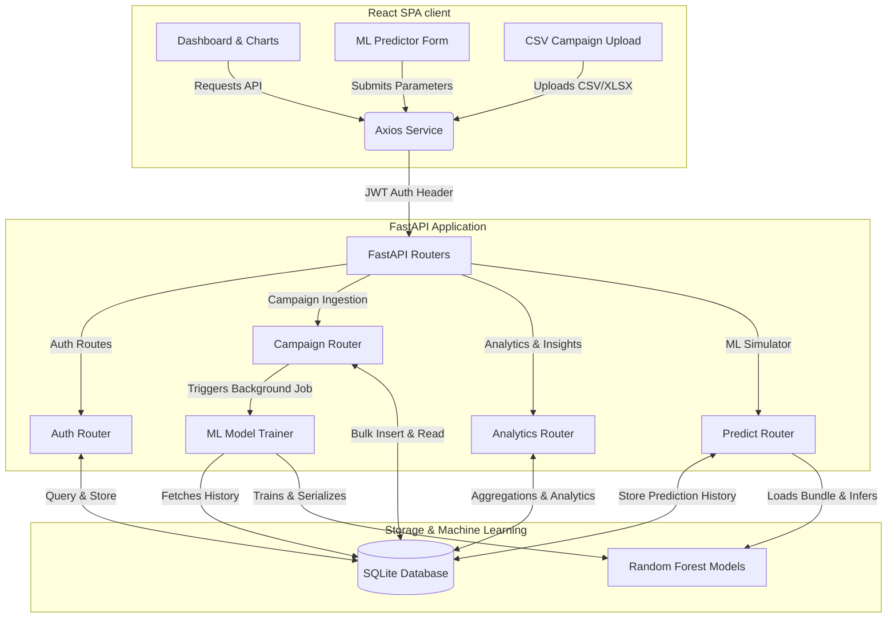

# 📊 MarketPulse AI

An AI-powered marketing analytics platform for campaign tracking, audience insights, and performance prediction using data-driven machine learning models and interactive dashboards.

[](https://fastapi.tiangolo.com/)
[](https://react.dev/)
[](https://tailwindcss.com/)
[](https://scikit-learn.org/)
[](https://sqlite.org/)
[](https://vite.dev/)
[](LICENSE)

---

## 🎯 Project Overview

MarketPulse is a full-stack marketing analytics platform designed to empower digital marketers and analysts with data-driven decision-making tools. By integrating historical campaign tracking with a machine learning engine, MarketPulse allows users to run simulated campaigns and predict key metrics (CTR, Conversion Rate, ROI) alongside a tailored success score before committing real ad spend.

---

## 🏛️ System Architecture

The following diagram illustrates how the frontend React SPA, backend FastAPI service, and SQLite database interact with the machine learning components:



---

## ✨ Key Features

| Feature | Description | Tech Highlight |
| :--- | :--- | :--- |
| **📊 Real-time KPIs** | Instant calculations of marketing health metrics including ROI, CTR, CPC, CAC, CPM, and total conversions. | Pandas & FastAPI |
| **📈 Dynamic Data Charts** | Timeseries trend lines, platform share breakdowns, and cross-channel efficiency comparison charts. | Recharts & Tailwind CSS |
| **🧠 ML Campaign Sandbox** | Simulates new campaign runs by predicting Click-Through Rate (CTR), Conversion Rate (CVR), Return on Investment (ROI), and a normalized Success Score. | Scikit-Learn (Random Forest) |
| **🎯 Audience Insights** | Deep demographic breakdowns by target device, audience age group, geography, and optimal hours. | SQL Aggregations & SQLite |
| **⚡ Intelligent Seeding** | Creates ~900 realistic campaign records automatically upon user registration for an immediate full platform experience. | Seed Ingestion Engine |
| **📂 Bulk CSV Ingestion** | Upload bulk campaigns in CSV/Excel formats with automated data validation, error handling, and background model retraining. | Pandas & FastAPI Background Tasks |
| **🔐 Secure Auth** | Complete user onboarding, password hashing, and token-based API request protection. | Passlib (Bcrypt) & PyJWT |

---

## 🔍 System Deep Dive

<details>
<summary><b>🚀 REST API Reference</b></summary>

### Authentication
* `POST /api/auth/register` - Registers a new analyst and triggers the background seeding of ~900 sample campaigns.
* `POST /api/auth/login` - Authenticates credentials and returns a JWT access token.
* `GET /api/auth/me` - Resolves details of the currently logged-in user.

### Campaigns Management
* `GET /api/campaigns/` - Returns all historical campaigns uploaded by the authenticated user.
* `GET /api/campaigns/template` - Downloads a pre-formatted sample CSV template for bulk uploads.
* `POST /api/campaigns/upload` - Ingests a CSV/Excel file, runs data checks, updates database, and initiates model retraining.
* `GET /api/campaigns/{id}` - Returns detail for a specific campaign.
* `DELETE /api/campaigns/{id}` - Deletes a campaign from database.

### Analytics & Reporting
* `GET /api/analytics/kpis` - Fetches aggregated dashboard metrics (ROI, CTR, CPC, CAC, CPM, conversions).
* `GET /api/analytics/charts` - Returns timeseries data, platform share ratios, and comparison values for charts.
* `GET /api/analytics/audience` - Retrieves breakdowns of device, age, geography, and hour metrics.

### AI Prediction Sandbox
* `POST /api/predict/` - Simulates a campaign by sending a set of features. Evaluates them against the user's trained ML models and returns predicted metrics.
* `GET /api/predict/history` - Returns the last 15 prediction simulations.
* `GET /api/predict/recommendations` - Generates account-wide optimization insights based on historical records.
</details>

<details>
<summary><b>💾 Database Schema</b></summary>

The project uses a relational SQLite database structure:

### 1. `users` Table
- `id` (INTEGER, PK) - Primary key.
- `name` (VARCHAR) - Full name of the user.
- `email` (VARCHAR, Unique) - Login email.
- `hashed_password` (VARCHAR) - Bcrypt hashed password.
- `created_at` (DATETIME) - Creation timestamp.

### 2. `campaigns` Table
- `id` (INTEGER, PK) - Primary key.
- `user_id` (INTEGER, FK -> users) - Owner reference.
- `campaign_name` (VARCHAR) - Name of the campaign.
- `platform` (VARCHAR) - Facebook, Google Ads, Instagram, TikTok, YouTube.
- `spend` (FLOAT) - Campaign spend.
- `clicks` (INTEGER) - Click-throughs.
- `impressions` (INTEGER) - Total ad views.
- `conversions` (INTEGER) - Conversion events.
- `revenue` (FLOAT, Nullable) - Attributed revenue.
- `device` (VARCHAR) - Mobile, Desktop, Tablet.
- `audience_age` (VARCHAR) - 18-24, 25-34, 35-44, 45-54, 55+.
- `geography` (VARCHAR) - Geography code (US, UK, CA, etc.).
- `hour` (INTEGER) - Ad scheduled hour (0-23).
- `date` (DATE) - Performance date.

### 3. `predictions` Table
- `id` (INTEGER, PK) - Primary key.
- `user_id` (INTEGER, FK -> users) - Owner reference.
- `campaign_name` (VARCHAR) - Title of simulated campaign.
- `platform` (VARCHAR) - Target platform.
- `spend` (FLOAT) - Budget configuration.
- `device`, `audience_age`, `geography`, `hour` - Simulated targeting parameters.
- `predicted_roi` (FLOAT) - Estimated ROI percentage.
- `success_score` (FLOAT) - Normalized rating of success (0 - 100).
- `expected_conversion_rate` (FLOAT) - Estimated conversion percentage.
- `recommendations` (VARCHAR) - JSON string containing real-time optimization warnings and tips.
</details>

<details>
<summary><b>🧠 Predictive ML Engine & Success Scoring</b></summary>

MarketPulse utilizes Python's **Scikit-Learn** library to train user-specific machine learning models. 

### Model Pipeline
1. **Feature Engineering**: Features include categorical inputs (`platform`, `device`, `audience_age`, `geography`) and numerical inputs (`hour`, `spend`).
2. **Preprocessing**: The categorical features undergo **One-Hot Encoding**, while numerical features are scaled using **StandardScaler** within a reusable pipeline.
3. **Random Forest Regression**: The backend trains **three independent Random Forest Regressors** per user to predict:
   - click-through rate ($CTR = \frac{\text{clicks}}{\text{impressions}} \times 100$)
   - conversion rate ($CVR = \frac{\text{conversions}}{\text{clicks}} \times 100$)
   - return on investment ($ROI = \frac{\text{revenue} - \text{spend}}{\text{spend}} \times 100$)

### Success Score Calculation
The overall **Success Score (0-99%)** is a normalized comparison between the simulated prediction and the user's historical performance. 
- Z-scores are computed for predicted CTR, CVR, and ROI based on the mean ($\mu$) and standard deviation ($\sigma$) of the user's historical data:
  $$Z = \frac{X_{\text{pred}} - \mu_{\text{hist}}}{\sigma_{\text{hist}}}$$
- Individual scores are scaled so that historical average yields approximately $60\%$ success, with bounds at $10\%$ and $99\%$:
  $$\text{Score} = \min(\max(60 + Z \times 15, 10.0), 99.0)$$
- The final score is a weighted average favoring financial performance:
  $$\text{Success Score} = 0.25 \times \text{Score}_{\text{CTR}} + 0.35 \times \text{Score}_{\text{CVR}} + 0.40 \times \text{Score}_{\text{ROI}}$$
</details>

---

## 🛠️ Local Setup & Development

Follow these steps to run the MarketPulse system locally on your machine.

### Prerequisites
- **Python 3.9+** installed on your system.
- **Node.js v18+** and **npm** installed.

---

### 1. Backend Setup

1. **Navigate to the backend folder**:
   ```bash
   cd backend
   ```

2. **Create and activate a virtual environment**:
   * **Windows (PowerShell)**:
     ```powershell
     python -m venv venv
     .\venv\Scripts\Activate.ps1
     ```
   * **macOS/Linux**:
     ```bash
     python3 -m venv venv
     source venv/bin/activate
     ```

3. **Install dependencies**:
   ```bash
   pip install -r requirements.txt
   ```

4. **Start the FastAPI server**:
   ```bash
   python main.py
   ```
   The backend server will start running on **`http://127.0.0.1:8000`** with auto-reload enabled.

---

### 2. Frontend Setup

1. **Navigate to the frontend folder**:
   ```bash
   cd frontend
   ```

2. **Install Node modules**:
   ```bash
   npm install
   ```

3. **Start the Vite development server**:
   ```bash
   npm run dev
   ```
   The frontend application will be hosted on **`http://localhost:5173`**.

> [!NOTE]
> All API requests made from the frontend to `/api/*` are automatically proxied to `http://127.0.0.1:8000` via Vite's proxy configurations in `vite.config.js`.

---

## 🧪 Pipeline Verification & Testing

To verify database seeding, analytics aggregations, ML model training, and simulator pipelines are functional, execute the backend test script:

```bash
# In the backend directory with active virtual environment:
python test_backend.py
```

This will run a full verification suite that:
1. Resets and initializes the SQLite database.
2. Registers a test user.
3. Seeds campaign data (~900 items).
4. Computes dashboard KPIs.
5. Trains Random Forest regressor models.
6. Simulates a campaign prediction run.
7. Compiles optimization advice from the recommendation engine.

---

## 📄 License

Distributed under the MIT License. See [LICENSE](LICENSE) for details.
