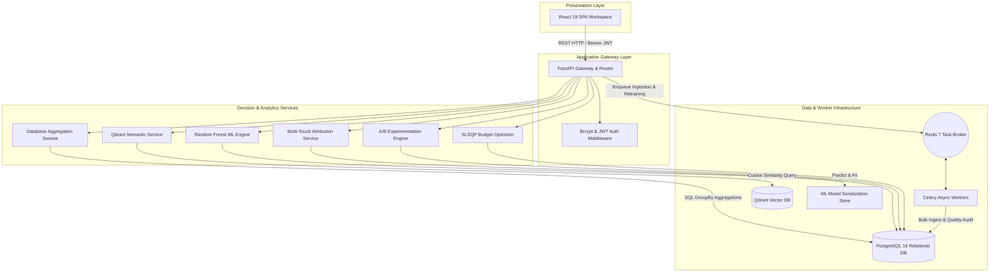

<p align="center">
  
</p>

<h1 align="center">MarketPulse</h1>

<p align="center">
  <strong>Enterprise Marketing Intelligence & Optimization Platform</strong>
</p>

<p align="center">
  Transform fragmented marketing data into measurable, evidence-backed decisions.
</p>

<p align="center">
  <a href="https://fastapi.tiangolo.com/"></a>
  <a href="https://react.dev/"></a>
  <a href="https://www.postgresql.org/"></a>
  <a href="https://qdrant.tech/"></a>
  <a href="https://redis.io/"></a>
  <a href="https://scikit-learn.org/"></a>
  <a href="https://www.docker.com/"></a>
  <a href="LICENSE"></a>
</p>

---

## Table of Contents

- [Product Overview](#product-overview)
- [Why MarketPulse?](#why-marketpulse)
- [The Marketing Intelligence Loop](#the-marketing-intelligence-loop)
- [Platform Capabilities](#platform-capabilities)
- [System Architecture](#system-architecture)
- [Enterprise Engineering Foundations](#enterprise-engineering-foundations)
- [Technology Stack](#technology-stack)
- [Repository Structure](#repository-structure)
- [API Overview](#api-overview)
- [Quick Start with Docker](#quick-start-with-docker)
- [Local Development Setup](#local-development-setup)
- [Automated Verification & Testing](#automated-verification--testing)
- [Documentation Directory](#documentation-directory)
- [License](#license)

---

## Product Overview

Modern marketing organizations operate across disconnected advertising channels (Google Ads, Meta, TikTok, Instagram), web analytics systems, and CRM databases. This fragmentation forces growth teams to rely on static backward-looking reporting, manual spreadsheets, and intuition when allocating performance budgets.

**MarketPulse** unifies campaign telemetry, machine learning, channel attribution, statistical experimentation, semantic vector search, and constrained budget optimization into a continuous decision-intelligence system.

```text
Campaign Data
     ↓
Analytics & Aggregations
     ↓
ML Predictive Engine
     ↓
Multi-Touch Attribution
     ↓
A/B Experimentation
     ↓
SLSQP Budget Optimization
     ↓
Evidence-Backed Actions
     ↓
Measured Outcomes
```

---

## Why MarketPulse?

Traditional marketing management relies on a manual feedback loop:

```text
Dashboard → Human Interpretation → Intuitive Decision
```

MarketPulse transitions marketing operations into an evidence-driven decision pipeline:

```text
Data → Statistical Evidence → ML Prediction → Bounded Optimization → Action → Feedback
```

### Analytics Spectrum

* **Traditional Analytics**: *"What happened?"* (Historical metrics, spend breakdown, total conversions).
* **Predictive Intelligence**: *"What is likely to happen?"* (Expected CTR, CVR, ROI, and uncertainty bounds).
* **Decision Intelligence**: *"What should we do?"* (Optimal budget distribution subject to spend caps and targets).

---

## The Marketing Intelligence Loop

MarketPulse models the continuous marketing lifecycle as a closed-loop intelligence process:

```text
  DATA  ──>  UNDERSTAND  ──>  PREDICT  ──>  ATTRIBUTE
   ^                                           │
   │                                           v
 LEARN  <──  MEASURE  <──  ACT  <──  OPTIMIZE  <── EXPERIMENT
```

1. **DATA**: Ingest and validate campaign performance telemetry across channels.
2. **UNDERSTAND**: Compute database-side SQL aggregates for ROI, CTR, CPC, CAC, and CPM.
3. **PREDICT**: Train temporal Random Forest models to forecast expected conversion yields.
4. **ATTRIBUTE**: Distribute conversion credit across touchpoints using multi-touch attribution algorithms.
5. **EXPERIMENT**: Test Control vs. Treatment variants using Welch's t-test and confidence intervals.
6. **OPTIMIZE**: Solve SLSQP constrained spend allocations to maximize portfolio returns.
7. **ACT**: Execute evidence-backed budget shifts across active channels.
8. **MEASURE**: Track incoming conversion telemetry in real time.
9. **LEARN**: Update model registries and refine semantic vector representations.

---

## Platform Capabilities

### Campaign Intelligence & Analytics
High-performance database-side SQL aggregations (`func.sum()`, `func.count()`) calculating real-time marketing metrics:
* **Key Indicators**: Return on Investment (ROI), Click-Through Rate (CTR), Cost Per Click (CPC), Customer Acquisition Cost (CAC), and Cost Per Mille (CPM).
* **Segment Analysis**: Device breakdown, demographic age cohorts, geographic acquisition efficiency, and hourly performance profiles.

### Predictive ML Platform
Temporal performance prediction powered by Scikit-Learn Random Forest Regressors:
* **Temporal Validation**: Time-ordered 80/20 train/test splits to prevent future data leakage.
* **Baseline Comparison Gates**: Model evaluation against naive historical means prior to serialization.
* **Ensemble Uncertainty Interval**: Calculates 90% prediction confidence bounds derived from estimator variance across decision trees.

### Multi-Touch Channel Attribution
Distributes conversion value across multi-touch customer journeys:
* **First Touch**: Assigns 100% credit to the initial touchpoint.
* **Last Touch**: Assigns 100% credit to the final converting channel.
* **Linear**: Distributes credit equally across all touchpoint channels.
* **Time Decay**: Exponential half-life decay weighting recent touchpoints higher.
* **Position-Based (40-20-40)**: Assigns 40% to first touch, 40% to last touch, and splits 20% across middle touchpoints.

### Statistical A/B Testing
Evaluates campaign variant performance using statistical hypothesis testing:
* **Lift Analysis**: Relative percentage conversion rate lift calculation.
* **Hypothesis Testing**: Welch's two-sample t-statistic and two-tailed p-value computation via `scipy.stats`.
* **Confidence Bounds**: Calculates 95% confidence intervals for conversion rate differences.

### Bounded SLSQP Budget Optimization
Constrained spend allocation optimization using SciPy Sequential Least Squares Programming (`scipy.optimize.minimize`):
* **Objective**: Maximizes expected portfolio revenue under dimishing marginal returns.
* **Constraints**: Enforces total budget equivalence and channel minimum/maximum spend percentages ($p_{\min} \le x_i / B \le p_{\max}$).

### Semantic Vector Intelligence
Semantic campaign retrieval powered by Qdrant vector database:
* **Dense Vectors**: 384-dimensional vector embeddings generated from canonical campaign descriptions.
* **Similarity Retrieval**: Cosine distance similarity search for past campaign discovery.
* **Tenant Isolation**: Mandatory payload filter evaluation (`workspace_id == active_workspace`).

---

## System Architecture



---

## Enterprise Engineering Foundations

### Multi-Tenancy & Governance
Implements strict 3-tier tenant hierarchy isolation:
$$\text{Organization} \longrightarrow \text{Workspace} \longrightarrow \text{Users \& Resources}$$
* Compound database indexing on `(organization_id, workspace_id)`.
* Role-Based Access Control (RBAC): `OWNER`, `ADMIN`, `ANALYST`, `VIEWER`.

### Data Quality & Ingestion Engine
Multi-stage automated validation pipeline for CSV/Excel data uploads:
* **Bound Validations**: Non-negative spend, clicks, impressions, and conversions.
* **Funnel Integrity**: Ensures $\text{clicks} \le \text{impressions}$ and $\text{conversions} \le \text{clicks}$.
* **Data Lineage**: Logs data quality reports containing valid rows, rejected records, and schema issues to `data_quality_reports`.

### Security Implementation
* **Password Hashing**: Native `bcrypt` key derivation.
* **Token Management**: OAuth2 Bearer Access Tokens and Refresh Token rotation.
* **Audit Trail**: Structured security event logging to `audit_logs` table.

---

## Technology Stack

| Layer | Technology | Version | Purpose |
| :--- | :--- | :--- | :--- |
| **Frontend** | React SPA | 19.2 | Responsive web workspace |
| **Styling & UI** | Tailwind CSS / Lucide | 3.4 / 0.359 | Interface components and icons |
| **API Gateway** | FastAPI | 0.110 | Asynchronous REST backend services |
| **Relational Database**| PostgreSQL | 16 | Structured relational data store |
| **Vector Database** | Qdrant | 1.8 | Semantic vector embeddings & similarity search |
| **Cache & Queue** | Redis | 7.2 | Message broker and caching layer |
| **Async Workers** | Celery | 5.3 | Background ingestion & ML task execution |
| **ML Modeling** | Scikit-Learn | 1.4 | Random Forest regression predictors |
| **Optimization** | SciPy | 1.12 | SLSQP bounded optimization & t-test statistics |
| **Containerization** | Docker Compose | v2 | 6-container production orchestration |

---

## Repository Structure

```text
MarketPulse/
├── assets/                       # Brand graphics and MarketPulse.png logo
├── docs/                         # Architecture, API specs, deployment & developer guides
│   ├── API_DOCUMENTATION.md      # Full REST API endpoint reference
│   ├── ARCHITECTURE.md           # Database ERD, C4 diagrams, decision engine algorithms
│   ├── DEPLOYMENT_GUIDE.md       # Docker Compose, environment configuration, Nginx setup
│   ├── DEVELOPER_GUIDE.md        # Local setup, testing guide, directory walk-through
│   └── PROJECT_STATUS.md         # Completed feature matrix and upcoming roadmap
├── docker-compose.yml            # 6-container deployment specification
├── backend/                      # FastAPI Backend Application
│   ├── app/
│   │   ├── analytics/            # Analytics aggregations & recommendation services
│   │   ├── api/                  # FastAPI routers (auth, campaigns, analytics, predict, v1)
│   │   ├── auth/                 # Bcrypt hashing, JWT tokens & RBAC permissions
│   │   ├── core/                 # App configuration & settings
│   │   ├── database/             # SQLAlchemy engine & synthetic seed data generator
│   │   ├── ml/                   # Scikit-Learn training, prediction & serialization
│   │   ├── models/               # SQLAlchemy multi-tenant ORM entities
│   │   ├── schemas/              # Pydantic v2 schemas
│   │   ├── services/             # Attribution, experimentation, optimization & vector services
│   │   └── workers/              # Celery background tasks
│   ├── Dockerfile
│   ├── main.py                   # FastAPI server entry point
│   ├── requirements.txt
│   └── test_backend.py           # Verification test suite
└── frontend/                     # React Vite Application
    ├── src/
    │   ├── assets/               # Local images & logo files
    │   ├── components/           # Reusable UI components (Sidebar, KpiCard)
    │   ├── pages/                # Views (Dashboard, Analytics, Predictions, CampaignUpload)
    │   └── services/             # Axios API client
    ├── Dockerfile
    ├── index.html
    └── package.json
```

---

## API Overview

Full endpoint documentation is available in [`docs/API_DOCUMENTATION.md`](docs/API_DOCUMENTATION.md). Interactive OpenAPI docs are served at `http://localhost:8001/docs`.

### Core Endpoint Groups

* **Authentication (`/api/auth`)**: User registration, login, token refresh, and user profile context.
* **Campaigns (`/api/campaigns`)**: Campaign data fetching, CSV/Excel file uploads, and template download.
* **Analytics (`/api/analytics`)**: Database-side SQL KPI calculation, timeseries datasets, and audience breakdowns.
* **Predictions (`/api/predict`)**: ML simulation queries, historical predictions, and automated optimization tips.
* **Enterprise Services (`/api/v1`)**:
  * `POST /api/v1/attribution` - Multi-touch channel attribution calculations.
  * `POST /api/v1/experimentation` - A/B test variant statistical lift evaluation.
  * `POST /api/v1/optimization` - Bounded SLSQP budget allocation solving.
  * `GET /api/v1/search/semantic` - Tenant-isolated Qdrant vector semantic search.
  * `GET /api/v1/jobs/{job_id}` - Background job status monitoring.

---

## Quick Start with Docker

Launch the complete 6-container stack (`PostgreSQL`, `Redis`, `Qdrant`, `Backend`, `Worker`, `Frontend`):

```bash
docker compose up -d
```

### Container Endpoint Mappings

| Service | Container Name | Host Port | Description |
| :--- | :--- | :--- | :--- |
| **Frontend Workspace** | `marketpulse_frontend` | `http://localhost:8080` | React SPA web workspace |
| **FastAPI Backend** | `marketpulse_backend` | `http://localhost:8001` | REST API application engine |
| **OpenAPI Documentation**| `marketpulse_backend` | `http://localhost:8001/docs` | Interactive Swagger UI |
| **Qdrant Vector Dashboard**| `marketpulse_qdrant` | `http://localhost:6335/dashboard` | Vector index visualizer |
| **PostgreSQL Database** | `marketpulse_postgres` | `localhost:5434` | Relational database instance |
| **Redis Cache/Broker** | `marketpulse_redis` | `localhost:6380` | Task queue broker |

---

## Local Development Setup

### Prerequisites
* Python 3.11+
* Node.js v20+ and npm

### 1. Backend Server Setup

```bash
cd backend
venv\Scripts\activate
python main.py
```
*Backend server runs at `http://127.0.0.1:8000`.*

### 2. Frontend Workspace Setup

```bash
cd frontend
npm install
npm run dev
```
*Frontend dev server runs at `http://localhost:5173`.*

---

## Automated Verification & Testing

Verify database schema creation, multi-tenant workspace provisioning, bcrypt authentication, analytics aggregations, Random Forest ML training, and decision engine calculations:

```bash
# Inside backend directory with active virtual environment:
python test_backend.py
```

---

## Documentation Directory

Detailed technical references and implementation guides are located in the [`docs/`](docs/) directory:

* **[Project Status & Roadmap](docs/PROJECT_STATUS.md)**: Implementation matrix of completed platform capabilities and upcoming roadmap items.
* **[System Architecture](docs/ARCHITECTURE.md)**: Multi-tenant database ERD, C4 diagrams, decision engine algorithms, and vector layers.
* **[REST API Specification](docs/API_DOCUMENTATION.md)**: Full REST API endpoint specifications, parameters, and response schemas.
* **[Production Deployment Guide](docs/DEPLOYMENT_GUIDE.md)**: Docker Compose orchestration, environment configuration, and Nginx setup.
* **[Developer Guide](docs/DEVELOPER_GUIDE.md)**: Local development setup, automated test suite commands, and repository structure.

---

## License

Distributed under the MIT License. See [LICENSE](LICENSE) for details.
