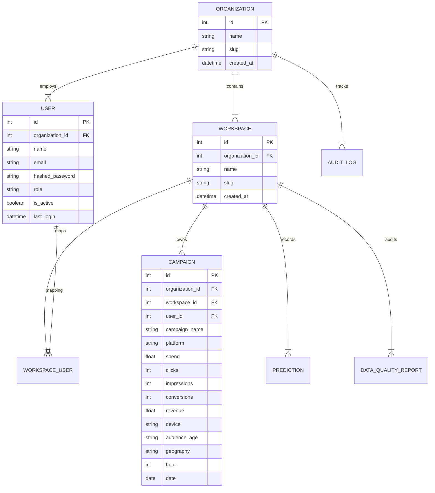

# 🏛️ MarketPulse AI Architecture Specification

This document provides a comprehensive architectural breakdown of the **MarketPulse AI Enterprise Marketing Intelligence & Optimization Platform**.

---

## 1. System Overview

MarketPulse AI is designed as an autonomous, multi-tenant decision-intelligence platform. It ingests high-volume marketing campaign telemetry, enforces schema and range data quality rules, computes database-side SQL aggregations, predicts performance metrics via temporal Scikit-Learn models, indexes semantic campaign vector representations in Qdrant, and runs decision engines for multi-touch attribution, A/B testing lift, and SLSQP constrained budget allocation.

```mermaid
graph TD
    %% Presentation Layer
    subgraph ClientLayer [Presentation Layer (React SPA)]
        A[Dashboard Analytics]
        B[Campaign Ingestion Console]
        C[ML Predictor & Sandbox]
        D[Attribution & Budget Optimizer]
        E[Semantic Vector Search UI]
    end

    %% Gateway & Application Layer
    subgraph AppLayer [Application Gateway & Router (FastAPI)]
        F[Auth & RBAC Middleware]
        G[Auth Router /api/auth]
        H[Campaign Router /api/campaigns]
        I[Analytics Router /api/analytics]
        J[Predict Router /api/predict]
        K[Enterprise Router /api/v1]
    end

    %% Service & Decision Layer
    subgraph DecisionLayer [Business Services & Decision Engines]
        L[Multi-Touch Attribution Engine]
        M[A/B Experimentation Engine]
        N[SLSQP Budget Optimization Engine]
        O[Qdrant Semantic Vector Service]
        P[Data Quality & Ingestion Engine]
    end

    %% Data & Worker Layer
    subgraph StorageLayer [Persistence & Worker Infrastructure]
        Q[(PostgreSQL 16 Relational DB)]
        R((Redis 7 Job Queue))
        S[Celery Background Workers]
        T[(Qdrant Vector Database)]
        U[Random Forest Model Registry]
    end

    ClientLayer -->|REST HTTP / Bearer JWT| AppLayer
    AppLayer --> DecisionLayer
    DecisionLayer <--> StorageLayer
```

---

## 2. Multi-Tenant Hierarchy & Isolation Model

MarketPulse implements a strict 3-tier multi-tenancy hierarchy:

`Organization` → `Workspace` → `Users & Resources`



### Role-Based Access Control (RBAC) Matrix

| Action | OWNER | ADMIN | ANALYST | VIEWER |
| :--- | :---: | :---: | :---: | :---: |
| Manage Organization & Billing | ✅ | ❌ | ❌ | ❌ |
| Provision Workspaces | ✅ | ✅ | ❌ | ❌ |
| Invite & Role Assignment | ✅ | ✅ | ❌ | ❌ |
| Upload Campaigns & Run ML Simulations | ✅ | ✅ | ✅ | ❌ |
| View Analytics & Export Reports | ✅ | ✅ | ✅ | ✅ |

---

## 3. Decision Engine Algorithms

### 3.1 Multi-Touch Attribution Engine
Distributes total conversion revenue $V$ across touchpoints $C = [c_1, c_2, \dots, c_n]$:
- **First Touch**: $A(c_1) = V, A(c_i) = 0 \quad \forall i > 1$
- **Last Touch**: $A(c_n) = V, A(c_i) = 0 \quad \forall i < n$
- **Linear**: $A(c_i) = \frac{V}{n}$
- **Position-Based (40-20-40)**: $A(c_1) = 0.4V, A(c_n) = 0.4V, A(c_i) = \frac{0.2V}{n-2}$ for middle touchpoints.
- **Time Decay**: Exponential half-life decay weights $w_i = 2^{i - n + 1}$, $A(c_i) = \frac{w_i}{\sum w_k} V$.

### 3.2 Constrained SLSQP Budget Allocation
Maximizes expected portfolio revenue $R(x)$ under budget $B$:
$$\max_{x} \sum_{i=1}^{k} x_i \left(1 + \frac{\text{ROI}_i}{100}\right) \left(1 - 0.1 \frac{x_i}{B}\right)$$
Subject to constraints:
$$\sum_{i=1}^{k} x_i = B, \quad B \cdot p_{\min} \le x_i \le B \cdot p_{\max}$$

---

## 4. Qdrant Vector Intelligence Architecture

Campaign records are converted into canonical text descriptions and embedded into 384-dimensional dense vectors:
- **Collection**: `campaign_embeddings`
- **Metric**: Cosine Distance
- **Payload Metadata**: `organization_id`, `workspace_id`, `campaign_id`, `platform`, `roi`, `cvr`
- **Tenant Isolation**: Every search query includes mandatory payload filter:
  `FieldCondition(key="workspace_id", match=MatchValue(value=workspace_id))`
